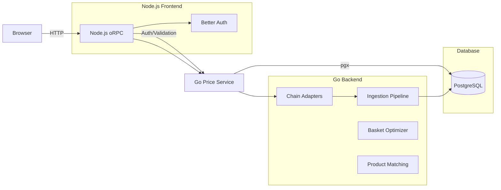
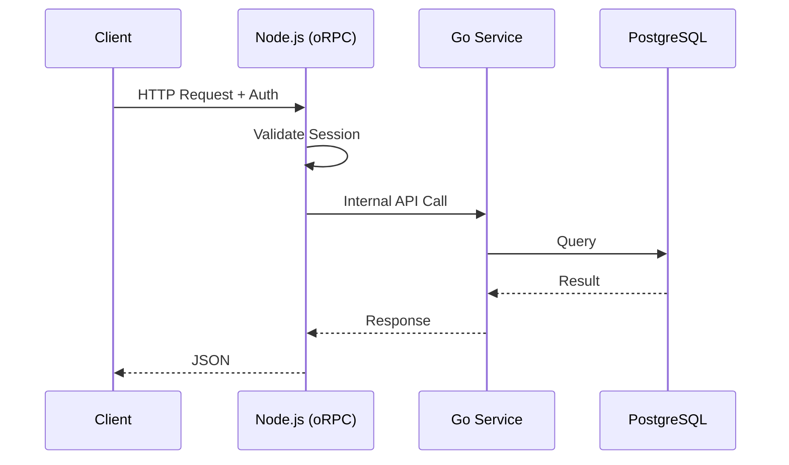
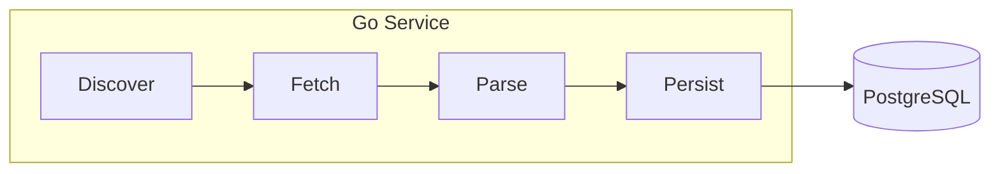
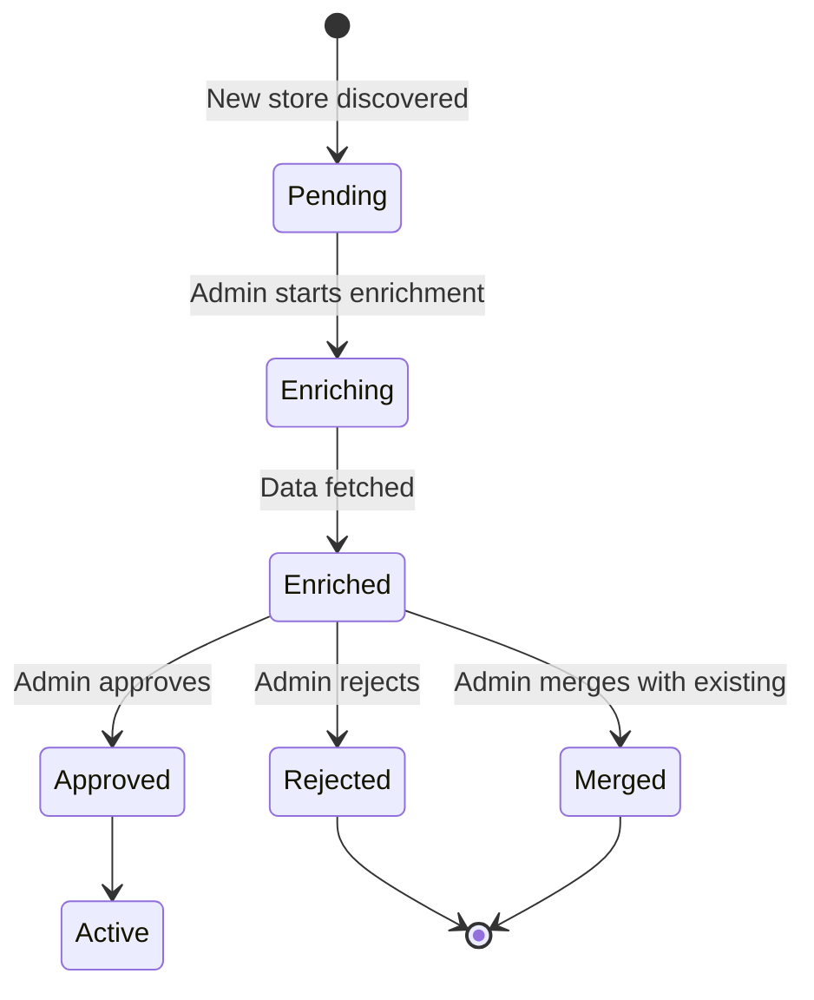
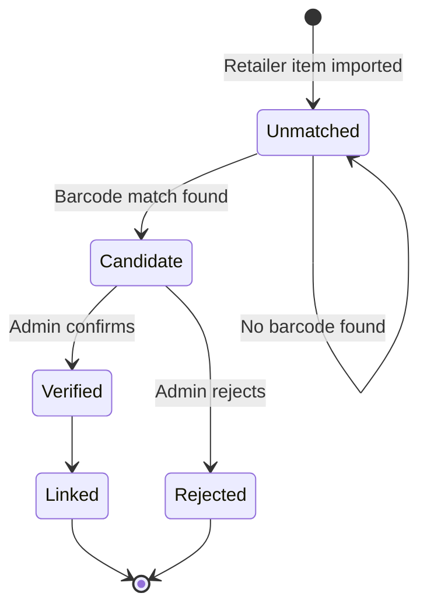
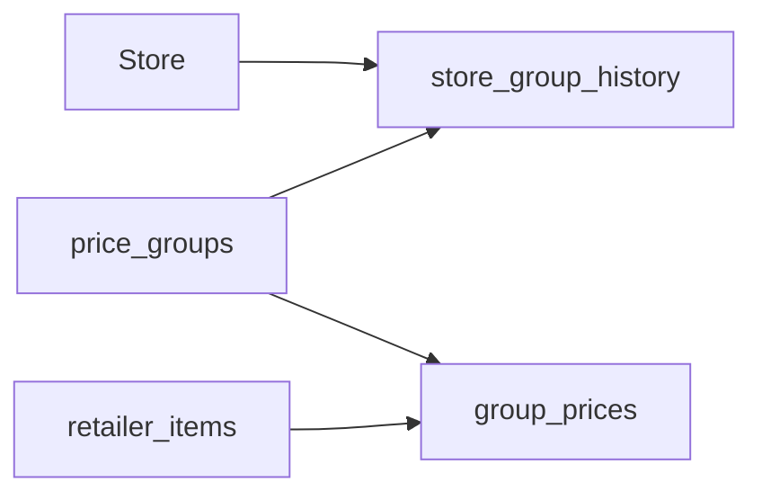

# Architecture

## Overview
**Kosarica** is a price tracking application for Croatian retail chains. It aggregates pricing data from 11 retail chains, normalizes it, and stores it for comparison.

## High-Level Design

```
┌─────────────────────────────────────────────────────────────┐
│                      Node.js Frontend                        │
│  ┌─────────────┐  ┌─────────────┐  ┌─────────────────────┐  │
│  │  TanStack   │  │   oRPC      │  │  Better Auth        │  │
│  │  Start SSR  │  │   API       │  │  (Passkey support)  │  │
│  └─────────────┘  └─────────────┘  └─────────────────────┘  │
└─────────────────────────────────────────────────────────────┘
                           │
                           ▼
┌─────────────────────────────────────────────────────────────┐
│                      Go Price Service                        │
│  ┌─────────────┐  ┌─────────────┐  ┌─────────────────────┐  │
│  │   11 Chain  │  │   Basket    │  │  Product            │  │
│  │  Adapters   │  │  Optimizer  │  │  Matching           │  │
│  └─────────────┘  └─────────────┘  └─────────────────────┘  │
└─────────────────────────────────────────────────────────────┘
                           │
                           ▼
                    ┌──────────┐
                    │PostgreSQL│
                    └──────────┘
```

## System Diagram (Mermaid)



## Data Flow Diagrams

### Request Path



### Ingestion Pipeline



## Schema Authority

**Drizzle ORM is the source of truth for ALL database tables.**

- Schema defined in `src/db/schema.ts`
- Go service reads schema, never writes migrations
- Migration workflow:
  1. Modify `src/db/schema.ts`
  2. Run `pnpm db:generate` (creates migration)
  3. Run `pnpm db:migrate` (applies migration)
  4. Go service auto-reads updated schema

## State Machines

### Store Enrichment



### Product Matching



## Key Subsystems

### Price Groups (Content-Addressable Deduplication)

- Prices are grouped by SHA-256 hash of all prices in a store
- Same prices = same group (~50% storage reduction)
- Immutable: new prices always create a new group
- Tables: `price_groups`, `store_group_history`, `group_prices`



### Circuit Breaker

Protects against cascading failures when calling external services:

- **Closed → Open**: 5 failures in 30 seconds
- **Open → Half-Open**: 30 second cooldown
- **Half-Open → Closed**: 1 successful request
- **Half-Open → Open**: Request fails

### Retry Logic

Exponential backoff for GET requests:

- Attempt 1: immediate
- Attempt 2: 1 second delay
- Attempt 3: 2 second delay
- Attempt 4: 4 second delay
- Max retries: 4

## Domain Model

### Retail World (source data)
- **chains** - Retail chains (konzum, lidl, plodine, etc.)
- **stores** - Physical store locations
- **store_identifiers** - Filename codes, portal IDs for store resolution
- **retailer_items** - Products as the retailer defines them
- **retailer_item_barcodes** - EAN/barcode mappings

### Canonical Catalog (normalized)
- **products** - Unified product definitions
- **product_aliases** - Alternative product names
- **product_links** - Links retailer_items → products
- **product_relations** - Variants, substitutes, bundles

### Price Data
- **price_groups** - Content-addressable price collections
- **store_group_history** - Store → price group over time
- **group_prices** - Individual item prices within a group

### Ingestion Tracking
- **ingestion_runs** - Batch runs with status/stats
- **ingestion_files** - Files processed per run

## Design Patterns

### Chain Adapter Pattern

Each retail chain implements `ChainAdapter` interface in Go:

```go
type ChainAdapter interface {
    Discover(ctx context.Context) ([]string, error)
    Fetch(ctx context.Context, url string) ([]byte, error)
    Parse(ctx context.Context, data []byte) ([]NormalizedRow, error)
    ExtractStoreIdentifier(filename string) string
}
```

Base classes: `BaseChainAdapter`, `BaseCsvAdapter`, `BaseXmlAdapter`

### Go Service Integration

Node.js calls Go via internal HTTP API:

- Base URL: `http://localhost:8080`
- Auth: `INTERNAL_API_KEY` header
- Tracing: `X-Request-ID` propagated
- Circuit breaker protects against failures

## Supported Chains

konzum, lidl, plodine, interspar, studenac, kaufland, eurospin, dm, ktc, metro, trgocentar

Each supports different file formats (CSV, XML, XLSX) with varying encodings (UTF-8, Windows-1250).
